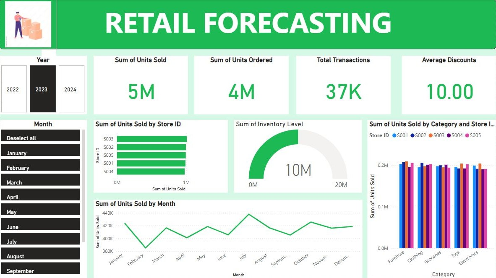

# InventoVision

## 🏬 Retail Store Inventory Analysis & Modeling

This project provides an end-to-end **data analysis and machine learning workflow** for retail store inventory optimization. It explores, cleans, engineers, and models inventory and sales data to predict **Units Sold**, helping retailers improve **demand forecasting**, **stock management**, and **pricing strategies**.

## Screenshot
Here is a screenshot from the Power BI dashboard:



## 📘 Project Overview

This notebook walks through:

1. **Data Loading & Cleaning** — Import and inspect the retail dataset, handle missing values, outliers, and data types.
2. **Exploratory Data Analysis (EDA)** — Analyze sales patterns, pricing relationships, and demand behavior using visualizations and statistics.
3. **Feature Engineering** — Create new predictive features such as rolling averages, lag features, demand ratios, and temporal attributes.
4. **Model Training** — Train and evaluate an **XGBoost Regression Model** to predict daily units sold.
5. **Evaluation & Insights** — Assess model performance with RMSE, MAE, and R²; visualize feature importance and predicted vs actual sales.
6. **Integration with Power BI** — Build a Power BI dashboard for dynamic visualization and reporting.

---

## 📊 Dataset

**Dataset URL:** [Retail Inventory Dataset](https://inventory-management-lcrh.onrender.com/inventory)

This dataset includes store-level daily inventory, sales, and pricing data.
Key columns:

* `Date`
* `Store ID`
* `Product ID`
* `Category`
* `Region`
* `Price`, `Discount`, `Competitor Pricing`
* `Inventory Level`, `Units Ordered`, `Units Sold`
* `Demand Forecast`
* `Weather Condition`, `Seasonality`, `Holiday/Promotion`

---

## 📈 Power BI Dashboard

Visualize insights using Power BI:

🔗 [Retail Inventory Power BI Dashboard](https://app.powerbi.com/reportEmbed?reportId=fe21d222-3d98-4743-a765-9e30b437b01c&autoAuth=true&ctid=ddaefc43-6062-456e-b110-98a82695e5c3)

---

## ⚙️ Project Structure

```
├── final_inventory.ipynb        # Main Jupyter Notebook
├── retail_store_inventory.csv   # Dataset file (to be downloaded)
├── README.md                    # Project documentation
└── requirements.txt              # Python dependencies (optional)
```

---

## 🧮 Dependencies

This project uses the following Python libraries:

```bash
pandas
numpy
matplotlib
seaborn
scikit-learn
xgboost
scipy
```

To install them:

```bash
pip install -r requirements.txt
```

Or manually:

```bash
pip install pandas numpy matplotlib seaborn scikit-learn xgboost scipy
```

---

## 🚀 How to Run

**Clone the repository**

```bash
git clone https://github.com/yourusername/retail-inventory-analysis.git
cd retail-inventory-analysis
```

**Install dependencies**

```bash
pip install -r requirements.txt
```

**Add dataset**

* Download the dataset from the provided link.
* Place it in the project root directory as `retail_store_inventory.csv`.

**Run the notebook**

```bash
jupyter notebook final_inventory.ipynb
```

Or run in Google Colab.

---

## 🧪 Model Details

**Algorithm:** XGBoost Regressor (`reg:squarederror`)

**Key Hyperparameters:**

* learning_rate: 0.01
* max_depth: 4
* subsample: 0.8
* colsample_bytree: 0.8
* reg_lambda: 11
* reg_alpha: 11
* min_child_weight: 10
* gamma: 0.5

**Evaluation Metrics:**

* Root Mean Squared Error (RMSE)
* Mean Absolute Error (MAE)
* R² Score

**Outputs:**

* Model performance metrics (Train/Test/Validation)
* Actual vs Predicted Sales bar plots
* Top 10 feature importances

---

## 🧠 Key Insights

* **Price vs Discount:** Strong negative correlation (\u2248 -0.98) — higher discounts lower prices.
* **Units Sold vs Price:** Negative correlation (\u2248 -0.54) — higher prices reduce demand.
* **Units Sold vs Discount:** Positive correlation (\u2248 +0.52) — discounts boost sales.
* **Inventory vs Sales:** Negative correlation — inventory decreases as sales increase.

---

## 🗕️ Feature Engineering Highlights

| Feature                     | Description                             |
| --------------------------- | --------------------------------------- |
| Daily Sales Rate            | Mean daily sales per product-store pair |
| Average Weekly Sales        | Aggregated weekly sales average         |
| Rolling_7d_Sales            | 7-day moving average of sales           |
| Lag_1_Sales                 | Previous day's sales value              |
| Days of Inventory Remaining | Inventory level / rolling daily sales   |
| Days_Since_Last_Restock     | Time gap since last restock date        |
| Temporal Features           | Day of week, week number, month, year   |

---

## 📊 Visualization Samples

* Correlation Matrix — Understand feature relationships
* Histogram & Density Plots — Explore numerical distributions
* Regression Plots — Demand vs Price/Discount
* Bar Chart — Actual vs Predicted Sales
* Feature Importance Chart — Top contributing variables in model

---

## 🧩 Future Enhancements

* Integrate time-series forecasting models (Prophet, ARIMA)
* Automate real-time data ingestion
* Develop API endpoints for live inventory updates
* Deploy model as a microservice for retail platforms

---

## 📜 License

This project is released under the **MIT License**.
Feel free to use, modify, and distribute with attribution.
